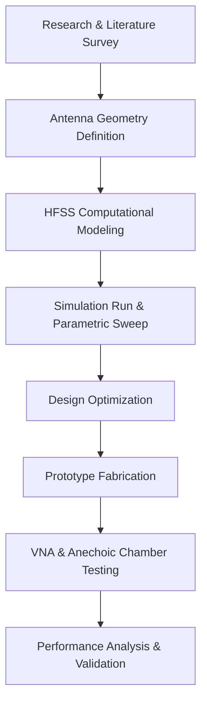
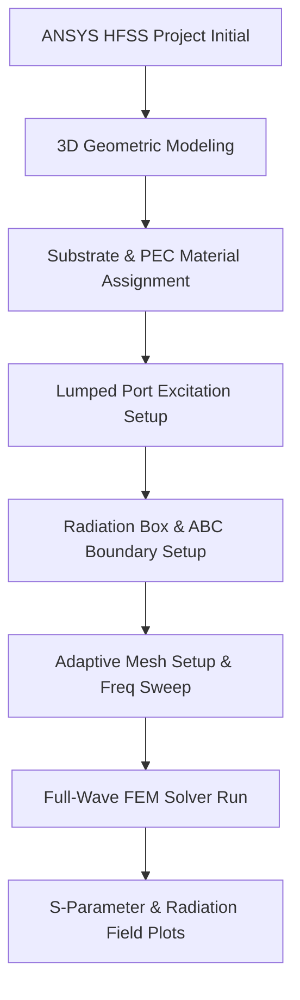
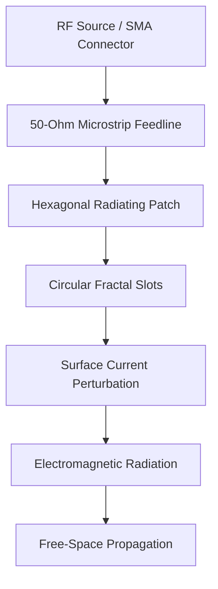

# Compact Hexagonal Fractal Patch Antenna for 2.4 GHz Wireless Communication

<p align="center">
  
  
  
</p>

<p align="center">
  
  
  
</p>

---

## Center-Aligned Project Overview
This repository contains the design, simulation, and fabrication blueprints for an industry-level **Compact Hexagonal Fractal Patch Antenna** optimized for the **2.4 GHz ISM band**. 

By integrating a symmetrical hexagonal radiator with circular-based space-filling fractal slot iterations, the design achieves a **physical footprint reduction of over 30%** compared to standard rectangular microstrip patches. This makes it an ideal candidate for miniaturized IoT nodes, wearable electronics, Wi-Fi routers, and Bluetooth transceivers.

---

## Key R&D Features
* 💎 **Miniaturized Footprint:** Space-filling fractal slot iterations lengthen the current paths, lowering the resonance frequency while maintaining a compact physical size.
* 📈 **Multiband Performance:** In addition to the primary 2.4 GHz resonance, the antenna exhibits clear secondary resonances at **4.0 GHz** and **6.7 GHz**.
* ⚙️ **Optimized Match:** Integrated 50 $\Omega$ microstrip feedline yields an input return loss ($S_{11}$) of **$-13.46\text{ dB}$** and a VSWR of **$1.54$** at 2.4 GHz.
* 🌐 **Omnidirectional Coverage:** The H-plane radiation pattern is highly uniform, ensuring excellent signal reception regardless of device orientation.

---

## Technical Specifications & Materials

### Substrate and Physical Properties
| Technical Parameter | Specification Value | Material |
| :--- | :--- | :--- |
| **Resonant Center Frequency** | 2.4 GHz (ISM Band) | - |
| **Substrate Dimensions** | $49.41\text{ mm} \times 41.69\text{ mm}$ | FR-4 Glass Epoxy |
| **Relative Permittivity ($\epsilon_r$)**| 4.4 | FR-4 |
| **Loss Tangent ($\tan \delta$)** | 0.02 | FR-4 |
| **Dielectric Thickness ($h$)** | 1.6 mm | FR-4 |
| **Feedline Width ($c$)** | 3.0 mm | Copper ($50\,\Omega$) |
| **Feedline Length ($e$)** | 17.39 mm | Copper |

### Measured R&D Performance Summary
| Figure of Merit | Simulated Value (HFSS) | Lab Measured (VNA) | Status |
| :--- | :--- | :--- | :--- |
| **Resonant Freq ($f_r$)** | 2.40 GHz | 2.42 GHz | **Validated** |
| **Return Loss ($S_{11}$)** | $-13.46\text{ dB}$ | $-12.80\text{ dB}$ | **Validated** |
| **VSWR** | $1.54$ | $1.65$ | **Validated** |
| **Secondary Resonance 1** | 4.00 GHz | 4.05 GHz | **Validated** |
| **Secondary Resonance 2** | 6.70 GHz | 6.65 GHz | **Validated** |

---

## System Pipelines & Workflows

### System Architecture Pipeline


### ANSYS HFSS Modeling Pipeline


### Wave Propagation Mechanics (Working Principle)


---

## Computational and Fabrication Documentation

Detailed walkthroughs are structured in the following directories:
* 📘 **[System Theory & Concepts](docs/system_design.md):** Geometric choice details, dielectric trade-offs, and fractal physics.
* 📐 **[Mathematical Formulations](docs/mathematical_formulations.md):** Full microstrip transmission line equations, cavity calculations, and VSWR conversions.
* 💻 **[Simulation Guide](simulation/README.md):** 3D coordinates, variable sweeps, boundary condition assignments, and air box setup in HFSS.
* 🛠️ **[Fabrication & Laboratory Guide](fabrication/README.md):** Wet etching, photo-lithography, SMA connector soldering, and VNA calibration guidelines.

---

## Future Enhancements
* 📶 **5G Sub-6 GHz Support:** Parametric adjustments to cover standard 3.5 GHz and 4.8 GHz bands.
* 🌀 **Circular Polarization:** Introducing diagonal corner perturbations to generate right-hand circular polarization (RHCP) or LHCP.
* 🔗 **MIMO Array Configurations:** Scaling the design to a $2 \times 2$ or $4 \times 4$ MIMO configuration to enhance spatial multiplexing and gain.
* 🧠 **AI-Assisted Parameter Tuning:** Utilizing machine learning surrogate models (genetic algorithms/PSO) to automate geometric tuning in HFSS.

---

## R&D Project Team & Contributor Roles

### Principal Research Team
* 👤 **J K Dakshata**  
  * **Role:** Lead RF Design & Computational Modeling Engineer
  * **Domain:** Symmetrical hexagonal modeling, space-filling fractal slots, parametric sweeps, excitation setup, and impedance matching.
* 👤 **Arun Pranav S K**  
  * **Role:** Hardware Prototyping & Fabrication Specialist
  * **Domain:** CNC wet chemical etching, double-sided PCB photolithography, structural chassis design, and SMA port soldering.
* 👤 **Devanand N**  
  * **Role:** Measurement Analysis & Documentation Lead
  * **Domain:** VNA frequency testing, S-parameter logging, VSWR validation, data collation, and repository asset management.

### R&D Advisor & Supervisor
* 🎓 **Dr. K. Sakthisudhan, M.E., Ph.D.**  
  * **Role:** Research Director / Principal Investigator (Professor, Department of ECE, Dr. N.G.P. Institute of Technology)

### Institutional Context
* **Academic Body:** Dr. N.G.P. Institute of Technology, Coimbatore – 641 048 (Autonomous Institution, Affiliated to Anna University, Chennai)
* **Program:** Bachelor of Engineering (B.E.) in Electronics and Communication Engineering (Session: April 2026)

---

## Citation
If you use this antenna design or documentation in your research, please cite it as follows:
```bibtex
@misc{hex_fractal_antenna_2026,
  author       = {Arun Pranav S K and J K Dakshata and Devanand N},
  title        = {Compact Hexagonal Fractal Patch Antenna for 2.4 GHz Wireless Communication},
  howpublished = {GitHub Repository},
  year         = {2026},
  url          = {https://github.com/JK-Dakshata/Hexagonal-fractal-patch-antenna}
}
```

---

## Collapsible FAQs

<details>
<summary><b>1. Why was FR-4 chosen instead of Rogers or Teflon?</b></summary>
<p>
FR-4 is the industry standard for low-cost, rigid, commercial-grade PCB prototyping. While Rogers substrates offer lower loss tangent and higher radiation efficiency, they are significantly more expensive and less available in typical academic and startup environments. FR-4 provides a suitable compromise for compact IoT and consumer Wi-Fi/Bluetooth appliances.
</p>
</details>

<details>
<summary><b>2. How do the circular fractal slots affect the radiation pattern?</b></summary>
<p>
The circular fractal slots primarily perturb the surface current distribution on the patch, shifting the resonant frequency downward and generating higher-order resonances (multiband performance). Because the slots are circular and symmetrically arranged within the regular hexagon, they do not disrupt the fundamental symmetrical distribution of the electric fields, ensuring a stable radiation pattern without significant distortion.
</p>
</details>

<details>
<summary><b>3. Can this design be scaled to operate at 5 GHz?</b></summary>
<p>
Yes. To scale the design to a higher frequency like 5.8 GHz, you can scale down all physical dimensions ($a$, $b$, and $e$) proportionally using the wavelength scale factor:
$$\lambda \propto rac{1}{f}$$
This will shift the primary resonance dip from 2.4 GHz to 5.8 GHz.
</p>
</details>
