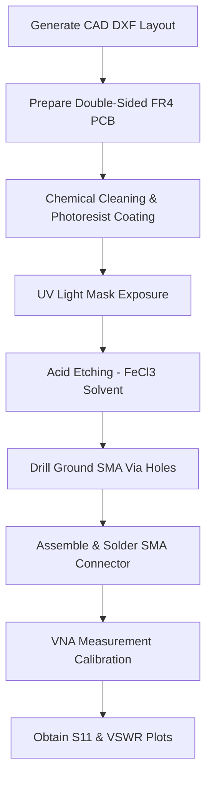

# PCB Fabrication & Measurement Guide

This document describes the laboratory fabrication process and physical measurement procedures for the **Compact Hexagonal Fractal Patch Antenna**.

---

## 1. Hardware Prototyping Pipeline

---

## 2. Step-by-Step Fabrication Procedure

### Step 1: Layout Export
1. Export the antenna geometry from **Autodesk Fusion** or **ANSYS HFSS** as a high-resolution `.dxf` or Gerber layout file.
2. Ensure the microstrip feedline width is configured exactly to $3.0\text{ mm}$ on the layout to preserve the $50\,\Omega$ match.

### Step 2: PCB Board Preparation
1. Clean a double-sided FR-4 PCB laminate ($49.41\text{ mm} \times 41.69\text{ mm}$ size, copper thickness $35\,\mu\text{m}$, dielectric thickness $1.6\text{ mm}$) to remove copper oxidation.
2. Apply a thin layer of photosensitive dry film or positive photoresist.

### Step 3: Photolithography & Etching
1. Print the top copper mask (hexagonal fractal patch and feedline) and bottom ground plane mask onto transparent films.
2. Align the films on the PCB and expose to UV light.
3. Submerge the exposed PCB in a sodium carbonate developer solution, then etch the unexposed copper away using a **Ferric Chloride ($FeCl_3$)** bath.
4. Strip the remaining photoresist to reveal the copper traces.

### Step 4: SMA Connector Assembly
1. Position the edge-launch $50\,\Omega$ SMA connector at the bottom terminal of the microstrip feedline.
2. Solder the central pin of the SMA connector directly to the $3\text{ mm}$ feedline trace.
3. Solder the chassis shielding pins to the bottom ground plane, ensuring a solid ground reference.

---

## 3. Laboratory VNA Verification Setup
To measure the antenna performance:
1. **Calibration:** Perform a full **SOLT (Short-Open-Load-Thru)** calibration on the Vector Network Analyzer (VNA) up to $10.0\text{ GHz}$.
2. **Measurement:** Connect the fabricated antenna to the VNA test port using a high-quality coaxial RF cable.
3. **Parameter Logging:** Record the real and imaginary parts of the input impedance ($Z_{in}$), the reflection coefficient ($S_{11}$), and the VSWR across the band to validate the HFSS simulation results.
