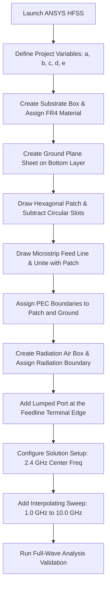

# Electromagnetic Simulation Setup & Workflow

This folder details the ANSYS HFSS modeling pipeline for the **Compact Hexagonal Fractal Patch Antenna**.

---

## 1. Simulation Setup Specifications

| HFSS Parameter | Assigned Value | Material | Layer | Description |
| :--- | :--- | :--- | :--- | :--- |
| **Substrate Box** | $49.41 \times 41.69 \times 1.6\text{ mm}$ | FR-4 epoxy | Center | Dielectric base ($E_r=4.4$) |
| **Ground Plane** | $49.41 \times 41.69\text{ mm}$ | Copper (PEC) | Bottom | Ground reference plane |
| **Radiating Patch** | Hexagonal Fractal | Copper (PEC) | Top | Primary radiating structure |
| **Feedline** | $17.39 \times 3.0\text{ mm}$ | Copper (PEC) | Top | $50\,\Omega$ Microstrip Feed |
| **Excitation Port**| Lumped Port / Wave Port | Waveguide | Edge | RF source feed ($50\,\Omega$ impedance) |
| **Radiation Box** | $120 \times 120 \times 80\text{ mm}$ | Air | Boundary | Absorbs outbound radiation |

---

## 2. Geometry Coordinates (ANSYS HFSS Variable Mapping)

Based on **Table 4.1** of the technical design parameters, the following coordinates are implemented in the modeler:

* **a (Substrate Length):** $49.41\text{ mm}$
* **b (Substrate Width):** $41.69\text{ mm}$
* **c (Feedline Width):** $3.00\text{ mm}$
* **d (Feed Offset Gap):** $6.64\text{ mm}$
* **e (Feedline Length):** $17.39\text{ mm}$

---

## 3. Step-by-Step Computational Workflow

### Steps to Run Simulation:
1. **Model Validation:** Ensure no intersecting sheets or validation errors exist by clicking **HFSS > Validation Check**.
2. **Analysis Run:** Click **Analyze All** to launch the FEM mesh generation and solver.
3. **Data Extraction:** Go to **Results > Create Modal Solution Data Report > Rectangular Plot** to plot the Return Loss ($S_{11}$) and VSWR curves.
